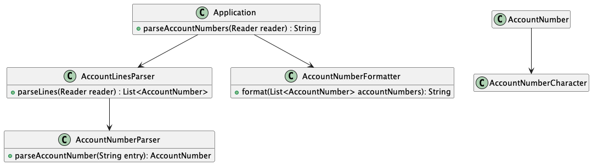

# Bank OCR Kata

Implementation is based on the requirements found
[here](https://github.com/testdouble/contributing-tests/wiki/Bank-OCR-kata).

The present implementation is incomplete. Presently, an input stream is read and the first entry of that stream is 
read and passed to a class responsible for converting each digit in an entry to an Account Number.

## Running Instructions
- The solution was built using Java 17
- Gradle is the build tool used to compile and ensure the application works
- To run the tests clean the project, run checkstyle, compile and run the tests:
  - Open a command line terminal
  - Navigate into the based `bank-ocr` directory
  - Run the build tool: `./gradlew`
- At this time the application is incomplete and the `Application` cannot be run - further implementation is required
to implement the main method before the Application can be considered runnable.

## Class Diagram

- `Application` is the base aggregate class where the application starts.
- `AccountLinesParser` parses each entry in the input file and passes the entry to the `AccountNumberParser` 
- `AccountNumberParser` is yet to be implemented and is intended to extract each character from the entry.
Once extracted, the intention is that the character will be passed to another class which will identify the character.
- `AccountNumberFormatter` is yet to be implemented. The intent of this class is to take a list of `AccountNumber`'s
and will create a formatted report.
- `AccountNumber` is yet to be implemented and represents an entry, it is composed of a list of `AccountNumberCharacter`'s.
- `AccountNumberCharacter` is yet to be implemented and represents a character within an `AccountNumber`.
The intention at the outset is for this class to be able to identify the number it represents and also identify whether
the character is unknown (a "?").

## Implementation Notes

- The solution makes use of Dependency Injection
- `Application` acts as the aggregate root and is responsible for "hand-wired" dependency injection
- Hand-wired dependency injection was used from the outset as it's unlikely that a large dependency graph will be needed.
Should this assumption prove wrong a framework such as Guice and Spring could be used, for now this isn't considered simple
- To reduce test brittleness, the builder pattern has been employed to create domain objects
(e.g. `AccountNumber` and `AccountNumberCharacter`). From experience, as a domain object grows in size and sophistication
builders are helpful in ensuring that "valid" domain objects are in use by the tests. This helps reduces the need to
continually update tests as the domain model grows in size
- `Mockito` mocks are in use through the application. A rule of only mocking dependency injected services is in place
No domain object is mocked as these are created and maintained through the use of the builders as described above
- `Checkstyle` is used to ensure the code meets specific code standards

## Areas for Improvements

Here are a list of areas for improvements - these represent what might be found on index cards to be kept track of
during development:
- Implement `Application.main` method to open file `Reader` which the `Application` can then process
- Have the `AccountLinesParser` parse multiple entries - not just the first
- Have the `AccountLinesParser` handle exceptions when reading from the `Reader`
- Implement the `AccountNumberFormatter`
- Adopt a naming convention which better reflects the "business" domain (e.g. entry, instead of "AccountLines"
found in the name "AccountLinesParser")
- Add code coverage